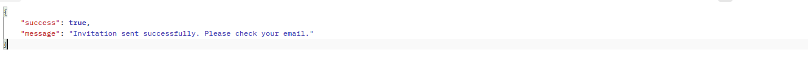
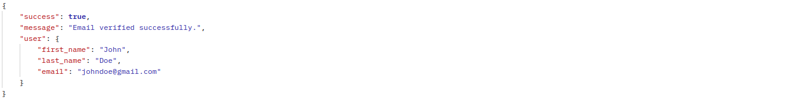
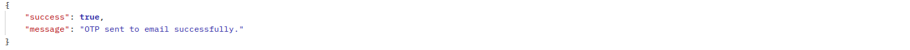
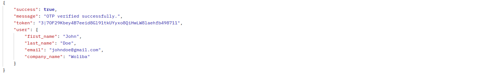
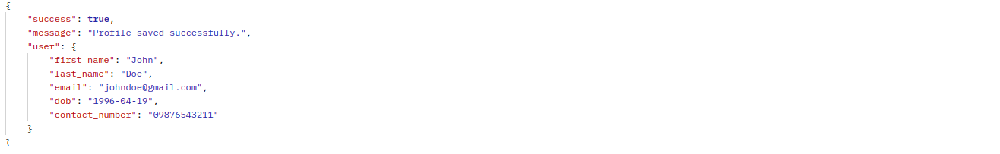
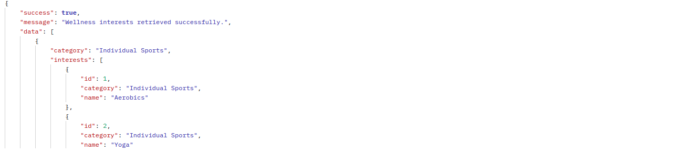
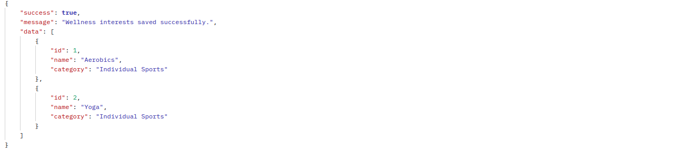
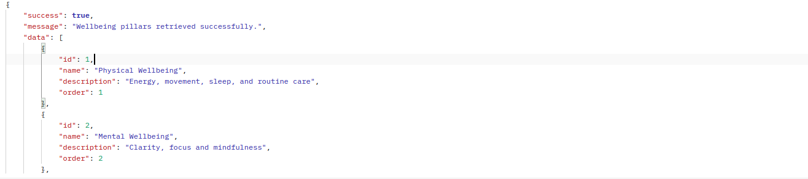
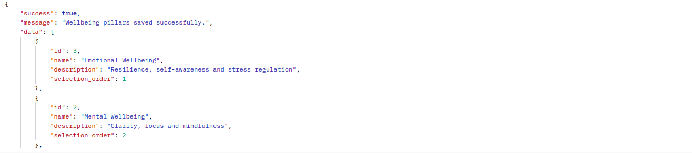

# Laravel Auth Coding Challenge - Magic Link & OTP Flows

A Laravel application implementing two authentication flows: Magic Link (passwordless) and Email + OTP authentication with user onboarding.

## Overview

This application provides secure authentication mechanisms with user invitation system, profile completion, and wellness preference selection. It supports both admin-invited users through magic links and direct registration with OTP verification.

### Key Features
- Magic Link Authentication (Flow 1)
- Email + OTP Authentication (Flow 2)
- Admin User Invitation System
- Secure Email Notifications
- Wellness Interests & Wellbeing Pillars Selection
- Password Security with Compromise Checking
- Comprehensive Test Coverage

## Quick Start

### Prerequisites
- PHP 8.2+
- Laravel 11.x
- MySQL 8.x (or SQLite)
- Composer
- Install Mailhog from https://github.com/mailhog/MailHog/releases

### Installation

1. **Clone the Repository**
   ```bash
   git clone https://github.com/your-username/laravel-auth-challenge.git
   cd laravel-auth-challenge
   ```

2. **Install Dependencies**
   ```bash
   composer install
   ```

3. **Environment Setup**
   ```bash
   cp .env.example .env
   php artisan key:generate
   ```

4. **Database Configuration**
   Update your `.env` file:
   ```env
   DB_CONNECTION=mysql
   DB_HOST=127.0.0.1
   DB_PORT=3306
   DB_DATABASE=laravel_auth_challenge
   DB_USERNAME=your_username
   DB_PASSWORD=your_password
   ```

5. **Mail Configuration**
   For development with Mailhog:
   ```env
   MAIL_MAILER=smtp
   MAIL_HOST=127.0.0.1
   MAIL_PORT=1025
   MAIL_USERNAME=null
   MAIL_PASSWORD=null
   MAIL_ENCRYPTION=null
   MAIL_FROM_ADDRESS="noreply@laravelauth.com"
   MAIL_FROM_NAME="${APP_NAME}"
   ```

6. **Run Config Clear Commands**
   ```bash
   php artisan config:clear
   ```

6. **Run Migrations & Seeders**
   ```bash
   php artisan migrate
   php artisan db:seed
   ```

7. **Start the Application**
   ```bash
   php artisan serve
   ```
8. **Start the Insalled Mailhog for Email Preview (Ubuntu)**
    ```bash
   mailhog
   ```
## API Documentation

### Authentication Flow 1: Magic Link

#### 1. Invite User
```http
POST /api/invite
Content-Type: application/json

{
    "email": "user@example.com",
    "first_name": "John",
    "last_name": "Doe"
}
```

#### 2. Get User Details by Magic Link
```http
GET /api/magic-link/user?token={token}
```

#### 3. Save User Profile
```http
POST /api/user/profile
Authorization: Bearer {token}

{
    "password": "SecurePass123",
    "dob": "1990-01-15",
    "contact_number": "+1234567890",
    "confirmation_flag": true
}
```

### Authentication Flow 2: Email + OTP

#### 1. Invite User
```http
POST /api/invite
Content-Type: application/json

{
    "email": "user@example.com",
    "first_name": "John",
    "last_name": "Doe"
}
```


#### 2. Magic Link User Details
```http
GET /api/magic-link/user?expires=expirationTime&token=hashedToken&signature=signature
```


#### 3 Verify Email
```http
GET /api/verify-email?email=user@example.com
```


#### 4. Send OTP
```http
GET /api/send-otp?email=user@example.com
```


#### 5. Verify OTP
```http
GET /api/verify-otp?email=user@example.com&otp=123456
```


#### 6. Save User Profile
```http
POST /api/invite
Content-Type: application/json
Authorization: Bearer {token}

{
    "password": "Secret123",
    "password_confirmation":"Secret123",
    "dob": "04/19/1996",
    "contact_number": "09876543211",
    "confirmation_flag":true
}
```


#### 7. Get Wellness Interests
```http
GET /api/wellness-interests

Content-Type: application/json
Authorization: Bearer {token}
```


#### 8. Save User Wellness Interests
```http
POST /api/wellness-interests
Authorization: Bearer {token}

{
    "interest_ids": [1, 2, 3, 5]
}
```


#### 9. Get Wellbeing Pillars
```http
GET /api/wellbeing-pillars

Content-Type: application/json
Authorization: Bearer {token}
```


#### 10. Save User Wellbeing Pillars
```http
POST /api/wellbeing-pillars
Authorization: Bearer {token}

{
    "pillar_ids": [1, 3, 5]
}
```


## 🗄️ Database Schema

### Core Tables
- `users` - User information and authentication
- `user_invitations` - Admin invitations with magic links
- `user_otps` - One-time passwords for email verification
- `wellness_interests` - Available wellness categories
- `wellbeing_pillars` - Available wellbeing pillars
- `user_wellness_interest` - User's selected interests
- `user_wellbeing_pillar` - User's selected pillars (exactly 3)

## 🧪 Testing

Run the test suite:

```bash
# Run all tests
php artisan test

# Run specific test
php artisan test --filter=Feature

```

### Test Coverage
- Magic Link Authentication Flow
- Email + OTP Authentication Flow
- User Invitation System
- Profile Completion
- Wellness Interests Selection
- Wellbeing Pillars Validation
- Security & Edge Cases

## Security Features

- **Magic Link Tokens**: Cryptographically secure, single-use tokens
- **OTP Generation**: Time-limited 6-digit codes
- **Password Security**: Laravel's built-in password validation with compromise checking
- **Email Verification**: Prevents unauthorized access

## Libraries & Tools Used

### Backend
- **Laravel 11.x** - PHP Framework
- **Laravel Sanctum** - API Authentication
- **Laravel Mail** - Email notifications
- **PHP Unit** - Testing framework
- **Carbon** - Date manipulation

### Development Tools
- **Mailhog** - Email testing

### Database
- **MySQL 8.x** - Primary database
- **Laravel Migrations** - Database versioning
- **Eloquent ORM** - Database interactions


## 📊 API Response Examples

### Successful User Invitation
```json
{
    "success": true,
    "message": "Invitation sent successfully",
    "data": {
        "invitation_id": "uuid-here",
        "email": "user@example.com",
        "expires_at": "2025-08-26T12:00:00Z"
    }
}
```

### Magic Link User Details
```json
{
    "success": true,
    "data": {
        "user": {
            "first_name": "John",
            "last_name": "Doe",
            "email": "user@example.com"
        },
        "token": "auth-token-here"
    }
}
```

### Wellness Interests Response
```json
{
    "success": true,
    "data": [
        {
            "id": 1,
            "name": "Yoga",
            "description": "Mind-body practice combining physical postures"
        },
        {
            "id": 2,
            "name": "Meditation",
            "description": "Mindfulness and mental clarity practices"
        }
    ]
}
```

---

**Note**: This application was built as a coding challenge demonstrating Laravel authentication patterns, security best practices, and modern PHP development techniques.